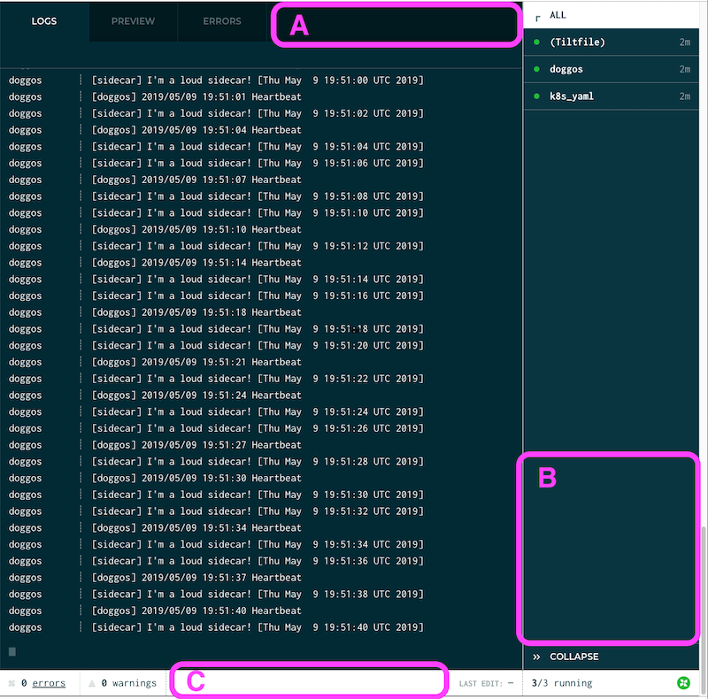

## Context and Goals

Currently, we prompt people to opt into (or out of) analytics the first time they run Tilt. Frustratingly, this is a blocking prompt -- the user can't continue to use Tilt until they respond. Not only does this jolt them out of flow, at this point the user has no reason to trust us yet, and has seen no value from Tilt that might make them willing to share their data. 

We want to *nudge* (non-blockingly) users to opt in/out of analytics at a time when they have already seen some value in Tilt and might be more willing to share information with us/more invested in our ability to support them. The nudge and opt in/out process should be easy and low-friction, and take the user out of their flow with Tilt as little as possible. It should also provide adequate context to the user about our analytics (at a time when the user will _not_ be thinking about this sort of thing): what information we send, how we use it, and how we respect their privacy.

### Non-goals of this spec:
* reviewing metrics we send, our messaging around analytics, our privacy policy
    * this should happen sometime, but this spec is about the technical implementation of the analytics nudge
* changing the way we record analytics decisions
    * currently we use the `analytics` package to record the user opt in/out to a file on disk (`~/.windmill/analytics/user/choice.txt`), and read this choice to know whether to record metrics. It might be nice to store additional information about the user's decision, e.g. a timestamp for their opt in/out so we can know whether to message them about a given analytics change. However, this is out of scope for the spec; all implementation below will use the existing `analytics` package/logic.

## Proposed Implementation
Broadly speaking, the components of this feature are:
1. *when* we nudge, and
2. *how* we nudge
    1. how we communicate to the user, "you need to opt in/out?"
    2. how the user then makes a choice, and how that choice propagates back to the analytics library

### When do we nudge?

We want to nudge users after they've seen some value from Tilt. Possible times to nudge them:
* when they reach workflow milestone X (e.g., at least one resource is up and running)
    * probably the easiest of all of these suggestions to verify, since we have the engine state at our disposal
* Y time after after install
    * write first_run timestamp to `~/.windmill/tilt` and check against that?
    * check modified time of the binary?
* after Z `tilt up` runs
    * write run_count to `~/windmill/tilt`?
    
I propose that we nudge the user **when they get their first resource up and running** (not including k8s_yaml), on the grounds that a. we know that they've seen Tilt *do* something by this point, and b. of all of the above options, this is the easiest to determine with the information we have available (i.e. we just have to check the engine state). 
    
### How do we nudge, and how does the user choose?

We should nudge the user in the Web UI, and allow them to select "opt-in" or "opt-out" via button click.

When Tilt determines that we need to nudge the user, we'll send that information along to the Web UI (as part of the Webview json) and render an unobtrusive nudge in sidebar (area B in this image), though in the status bar (C) or in the nav bar (A, though this conflicts with Sail share info) are also possibilities. (Particularly if we nudge when the user gets their first resource up and running, seems safe to assume that we'll have space to spare in the sidebar.)

 

The nudge will consist of some copy tbd, and buttons for "opt in" and "opt out". Clicking one of those buttons sends an HTTP request back to the HUD server, which propagates it to the relevant analytics code (which writes the user's choice to disk, as normal). (If something goes wrong with this process, we log the error and replace the buttons with a "something went wrong, try again later" message.)

Copy TDB: either something straight-forward like "opt into analytics to help us better support you!" or a reference to the condition under which we nudged (see above) like, "Congrats on your first Tilt deploy 🎉 want to send analytics to help us better support you?" Will contain a "read more" link to a page on our website about privacy policy, how we use metrics, what metrics we send, etc.

#### Alternatives considered
1. nudge in the TUI.
    * we don't want to be adding more functionality to the TUI at this time, as we're trying to move towards the Web UI as the way of the future
2. have the user run the existing `tilt analytics` command
    * having to switch back to their terminal interrupts the user's flow with Tilt and makes our analytics seem extra annoying -- not to mention that it's especially weird to take a user _out_ of the Web UI when we're trying to establish its primacy 
3. nudge in the "Alerts" pane
    * it's appealing to use the Alerts pane to mark "opt in/out of analytics" as an outstanding action item, but it seems too agressive.
4. a "snooze"/"ask me again later" feature
    * not only would we have to implement something to track when we last nudged/when to nudge again, I expect that that the bigger of a deal we make opting in/out of analytics, the bigger a deal it will seem to the _user_, and that the more chance we give them to put it off, the more they _will_ put it off.

## Risks
* if we mess something up technically or implement this nudge in a way that doesn't resonate with users (e.g. they don't see it, they get annoyed and hit "no", we don't provide them enough information and they hit "no" out of fear), we risk a gap in metrics. This makes it harder for us to know what's going on with our product and could negatively affect fundraising
* the timing, wording, and placement of the nudge are all shots in the dark; ideally we'll have a little time to try them out, gather user feedback, and iterate on them before Kubecon. (If we don't get this chance before Kubecon though, we should certainly do this afterwards.)
