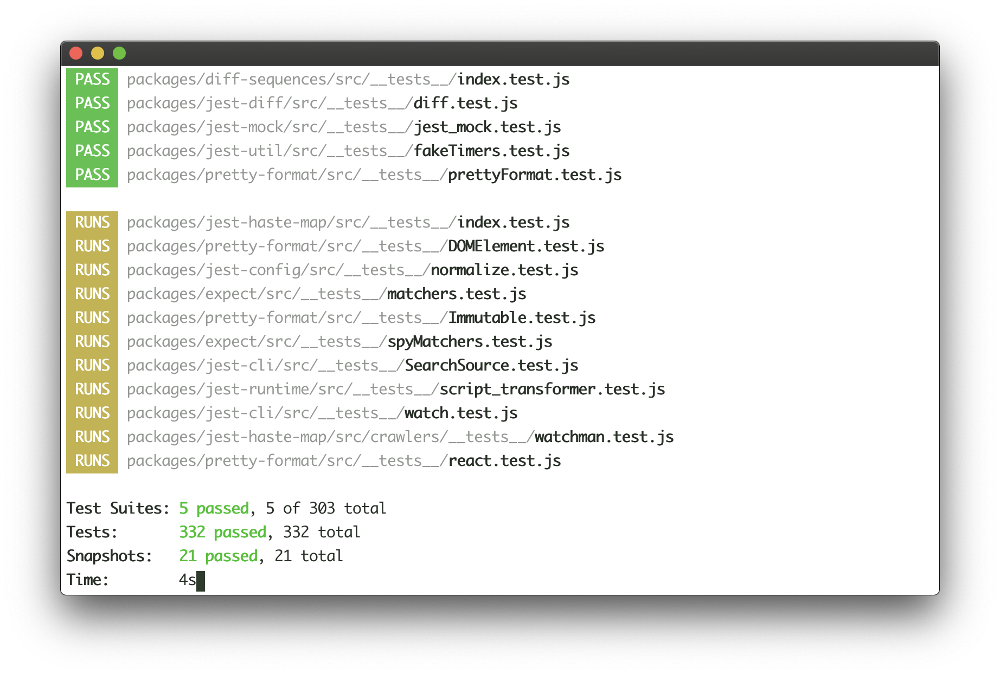

## Overview

Tilt already makes it easy to see the given state of your cluster and code builds that will be sent to that cluster. It seems natural for Tilt to also show you the state of your tests, but today it’s not obvious how to do that. And what is a test but a build failure of another flavor?

This feature has been requested by people in the #tilt channel as well as the folks at Mindspace and [Replicated](https://windmill-eng.slack.com/archives/C9Z045JAW/p1549652085091700?thread_ts=1549650781.086000).

## Background

#### Why should tilt run unit tests?

Tilt’s HUD is so close to being the one-stop shop for the *first* place you look when something goes wrong during development. It’s frustrating when you have to look somewhere else for such a common case (Did my tests fail? Which test failed?).

#### What’s the state of the art for running unit tests?

In my opinion the Javascript unit testing framework Jest has the best test running experience. It’s a CLI program that you start from the root of your project. Every time you save a file it runs the tests associated with that file. It provides a nice UI where you can see at a glance which tests were run, their pass/fail status and some other metadata. 

## Goals and non-goals

### Goals

* It’s possible to define batch unit tests to run in Tilt

* You can see at a glance if tests failed

### Non-goals

* Making unit tests fast. Things like go unit tests would be slow because they wouldn’t be able to make use of the cache.

* Supporting live-running unit tests like jest and sbt

* Showing individual unit tests in the UI

## Detailed Design

As a first pass I think tests should be implemented as Kubernetes Jobs that would show up in the HUD like any other kubernetes job. The Tiltfile function would look like this:


```

unit_test(image, ‘make test’)
```

This function would take the supplied image and test command, substitute them into a Kubernetes Job template, and deploy it to the cluster. Whenever image gets rebuilt it would re-run the tests.

In the short term I would implement this entirely in Starlark to allow customizability.

The supplied image could even be a fast build image to make use of any test caching that the users testing framework might provide (eg go test, jest).

## Alternative approaches

TODO

**In-container, local builds:**

Instead of running tests as jobs start a container locally and keep it open with `tail -f /dev/null` or similar. Run tests in that container with `docker exec`

Pros:

* Better able to take advantage of caching

* No need to go out to a remote cluster for test results

Cons:

* No existing support for local containers in Tilt

## Future work

Special test UI

Breaking tests down

Integration tests

Cluster build/test

